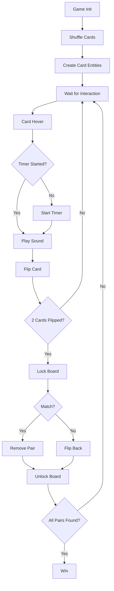

# Architecture Overview

Forsaken Casino is built on A-Frame 1.4.0, leveraging WebVR/WebXR capabilities to create an immersive horror-themed memory card game experience.

## Scene Structure

The game follows A-Frame's Entity-Component-System (ECS) architecture with a hierarchical scene graph.

### Scene Configuration

The root scene includes atmospheric fog for a horror ambiance:

```html
<a-scene fog="type: exponential; color: #0a0000; density: 0.15">
```

**Key Properties:**
- **Fog type**: Exponential for realistic depth perception
- **Color**: Deep red (#0a0000) for ominous atmosphere
- **Density**: 0.15 for optimal visibility balance

## Asset Management System

All game assets are preloaded in the `<a-assets>` block for optimal performance:

```html
<a-assets>
  
  
  
  
  
  
  
  <audio id="click-sound" src="cartas.mp3">
  <audio id="background-music" src="fondo.mp3" preload="auto">
</a-assets>
```

<Info>
Assets are cached by A-Frame's asset management system, reducing network requests and ensuring smooth gameplay.
</Info>

### Asset Categories

<CardGroup cols={2}>
  <Card title="Visual Assets" icon="image">
    - 4 unique card face images (img1-img4)
    - Card back texture (atras.jpeg)
    - Floor carpet texture (piso.jpg)
    - Wall stone texture (lados.jpg)
  </Card>
  <Card title="Audio Assets" icon="volume">
    - Card flip sound effect (cartas.mp3)
    - Background music loop (fondo.mp3)
  </Card>
</CardGroup>

## Entity Hierarchy

### Camera Rig System

The player's viewpoint is controlled through a rig-camera hierarchy:

```html
<a-entity id="rig" position="0 1.6 1.2">
  <a-entity id="camera" camera look-controls wasd-controls="acceleration: 10" 
            rotation="-25 0 0">
    <a-cursor id="cursor" raycaster="objects: .clickable" 
              material="color: #ff0000" scale="0.5 0.5 0.5"></a-cursor>
    <a-text id="timerText" value="VIDA: 40s" color="red" 
            position="0 0.5 -1" scale="0.4 0.4 0.4" align="center"></a-text>
    <a-plane id="deathOverlay" position="0 0 -0.05" width="2" height="2" 
             color="#300" material="opacity: 0; transparent: true"></a-plane>
  </a-entity>
</a-entity>
```

**Hierarchy Breakdown:**

<Steps>
  <Step title="Rig Entity">
    Positioned at `0 1.6 1.2` (standing height, slightly forward)
    
    Acts as container for camera and controls
  </Step>
  
  <Step title="Camera Entity">
    Tilted down 25° to focus on the table
    
    Includes `look-controls` for VR head tracking and `wasd-controls` for desktop navigation
  </Step>
  
  <Step title="Child Elements">
    - **Cursor**: Red raycaster for card interaction
    - **Timer Text**: HUD element showing remaining time
    - **Death Overlay**: Fade-to-red effect on game over
  </Step>
</Steps>

### Lighting System

Two-light setup creates the horror atmosphere:

```html
<a-light type="ambient" color="#444"></a-light>
<a-light id="flicker" type="point" intensity="1" position="0 3 0" color="#f00"
         animation="property: intensity; from: 0.2; to: 1.2; dur: 150; 
                    loop: true; dir: alternate"></a-light>
```

<Warning>
The flickering point light creates an unsettling effect. Adjust the animation duration (currently 150ms) to control flicker speed.
</Warning>

### Environment Entities

```html
<a-sky color="#000"></a-sky>
<a-plane src="#carpet" rotation="-90 0 0" width="30" height="30" color="#222"></a-plane>
<a-box src="#stone" position="0 4 -6" width="20" height="10" depth="0.5" color="#333"></a-box>
```

**Environment Components:**
- **Sky**: Pitch black backdrop
- **Floor**: 30x30 unit textured plane with dark tint
- **Wall**: Textured box serving as background

### Game Table Structure

The card table consists of nested cylinders:

```html
<a-entity position="0 0 0">
  <a-cylinder color="#111" position="0 0.4 0" radius="0.05" height="0.8"></a-cylinder>
  <a-cylinder color="#1a0f00" position="0 0.8 0" radius="1" height="0.08"></a-cylinder> 
  <a-cylinder color="#002200" position="0 0.81 0" radius="0.95" height="0.04"></a-cylinder>
</a-entity>
```

<Tip>
The table uses three cylinders: a pole (0.05 radius), the main table surface (radius 1), and a felt surface (radius 0.95 with green tint).
</Tip>

### Game Board Container

The dynamic card grid is generated within this entity:

```html
<a-entity id="board" position="-0.3 0.85 0.2" rotation="-90 0 0" scale="0.5 0.5 0.5"></a-entity>
```

**Position Details:**
- **X**: -0.3 (slightly left of center)
- **Y**: 0.85 (on table surface)
- **Z**: 0.2 (forward offset)
- **Rotation**: -90° on X-axis (laid flat)
- **Scale**: 0.5 (reduces card grid size)

## JavaScript Architecture

The game logic is implemented using vanilla JavaScript with direct DOM manipulation:

```javascript
const board = document.querySelector('#board');
const timerText = document.querySelector('#timerText');
const statusText = document.querySelector('#statusText');
const deathOverlay = document.querySelector('#deathOverlay');
```

### State Management

```javascript
let timeLeft = 40;
let timerInterval;
let gameActive = false;
let pairsFound = 0;
let lockBoard = false; // LLAVE MAESTRA PARA EVITAR TRABAS
const cardData = ['img1', 'img1', 'img2', 'img2', 'img3', 'img3', 'img4', 'img4'];
```

<Info>
The `lockBoard` variable is critical for preventing race conditions when players interact with cards too quickly.
</Info>

## Data Flow



## Performance Considerations

<CardGroup cols={2}>
  <Card title="Asset Preloading" icon="bolt">
    All textures and audio files are preloaded to prevent stuttering during gameplay.
  </Card>
  
  <Card title="Animation Timing" icon="clock">
    Card flip animations are 250ms with synchronized texture swaps at the 125ms midpoint.
  </Card>
  
  <Card title="Board Locking" icon="lock">
    The `lockBoard` mechanism prevents multiple simultaneous card interactions.
  </Card>
  
  <Card title="Memory Management" icon="memory">
    Game reloads after win/loss to clear memory and reset state.
  </Card>
</CardGroup>

## Next Steps

<CardGroup cols={3}>
  <Card title="Game Logic" icon="code" href="/development/game-logic">
    Explore the core JavaScript functions
  </Card>
  
  <Card title="Customization" icon="paintbrush" href="/development/customization">
    Learn how to modify the game
  </Card>
  
  <Card title="Game Logic" icon="brain" href="/development/game-logic">
    Explore the core game functions
  </Card>
</CardGroup>