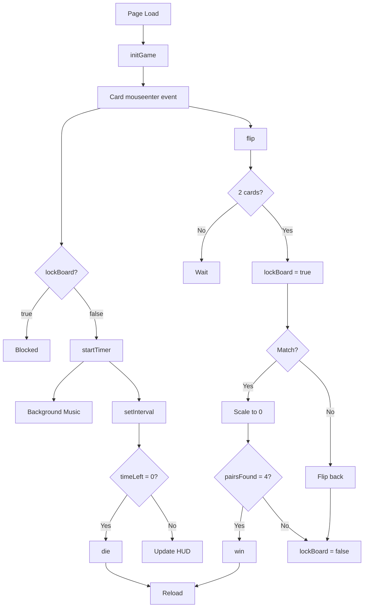

# Game Logic

The game implements a timer-based memory card matching system with state management to prevent race conditions and ensure smooth gameplay.

## Core State Variables

The game maintains six critical state variables:

```javascript
let timeLeft = 40;
let timerInterval;
let gameActive = false;
let pairsFound = 0;
let lockBoard = false; // LLAVE MAESTRA PARA EVITAR TRABAS
const cardData = ['img1', 'img1', 'img2', 'img2', 'img3', 'img3', 'img4', 'img4'];
```

<Info>
**State Variable Reference:**
- `timeLeft`: Remaining seconds (starts at 40)
- `timerInterval`: Reference to countdown timer
- `gameActive`: Prevents timer from starting multiple times
- `pairsFound`: Win condition tracker (game ends at 4 pairs)
- `lockBoard`: Critical lock preventing simultaneous card flips
- `cardData`: Array of 8 cards (4 pairs)
</Info>

## Game Initialization

### initGame() Function

Called once on page load to set up the card grid. Source: index.html:86-113

```javascript
function initGame() {
    board.innerHTML = '';
    const shuffled = [...cardData].sort(() => Math.random() - 0.5);
    shuffled.forEach((imgId, index) => {
        const x = (index % 4) * 0.4; 
        const y = Math.floor(index / 4) * -0.6;
        const card = document.createElement('a-box');
        
        card.setAttribute('position', `${x} ${y} 0`);
        card.setAttribute('width', '0.35'); 
        card.setAttribute('height', '0.5'); 
        card.setAttribute('depth', '0.01');
        card.setAttribute('src', '#back');
        card.setAttribute('class', 'clickable');
        card.dataset.id = imgId;
        card.dataset.flipped = "false";

        card.addEventListener('mouseenter', function() {
            // Si el tablero está bloqueado o la carta ya se giró, NO HACER NADA
            if (lockBoard || this.dataset.flipped === "true" || timeLeft <= 0) return;
            
            startTimer();
            new Audio(document.querySelector('#click-sound').src).play();
            flip(this);
        });
        board.appendChild(card);
    });
}
```

<Steps>
  <Step title="Clear the Board">
    Removes any existing cards with `board.innerHTML = ''`
  </Step>
  
  <Step title="Shuffle Cards">
    Uses Fisher-Yates-inspired shuffle with `Math.random() - 0.5`
    
    <Warning>
    This shuffle method has slight bias. For production, use a proper Fisher-Yates implementation.
    </Warning>
  </Step>
  
  <Step title="Generate Grid">
    Creates a 4x2 grid using position calculation:
    - **X position**: `(index % 4) * 0.4` creates 4 columns
    - **Y position**: `Math.floor(index / 4) * -0.6` creates 2 rows
  </Step>
  
  <Step title="Create Card Entities">
    Each card is an `<a-box>` with:
    - Width: 0.35, Height: 0.5, Depth: 0.01 (thin rectangle)
    - Back texture applied by default
    - `clickable` class for raycaster detection
    - `data-id` stores which image pair it belongs to
    - `data-flipped` tracks current state
  </Step>
  
  <Step title="Attach Interaction">
    The `mouseenter` event triggers on cursor hover:
    1. Guards against invalid interactions
    2. Starts the timer on first card flip
    3. Plays flip sound effect
    4. Calls `flip()` function
  </Step>
</Steps>

### Grid Layout Calculation

```javascript
const x = (index % 4) * 0.4; 
const y = Math.floor(index / 4) * -0.6;
```

**Example positions for 8 cards:**

| Index | X Calculation | Y Calculation | Position |
|-------|---------------|---------------|----------|
| 0 | (0 % 4) * 0.4 = 0 | floor(0/4) * -0.6 = 0 | 0, 0 |
| 1 | (1 % 4) * 0.4 = 0.4 | floor(1/4) * -0.6 = 0 | 0.4, 0 |
| 4 | (4 % 4) * 0.4 = 0 | floor(4/4) * -0.6 = -0.6 | 0, -0.6 |
| 7 | (7 % 4) * 0.4 = 1.2 | floor(7/4) * -0.6 = -0.6 | 1.2, -0.6 |

## Timer System

### startTimer() Function

Source: index.html:67-77

```javascript
function startTimer() {
    if(!gameActive) {
        gameActive = true;
        document.querySelector('#bgMusic').components.sound.playSound();
        timerInterval = setInterval(() => {
            timeLeft--;
            timerText.setAttribute('value', `VIDA: ${timeLeft}s`);
            if(timeLeft <= 0) die();
        }, 1000);
    }
}
```

<Tabs>
  <Tab title="Functionality">
    **Key Features:**
    - Only runs once (guarded by `gameActive` flag)
    - Starts background music on first card flip
    - Decrements `timeLeft` every 1000ms (1 second)
    - Updates HUD text element in real-time
    - Triggers `die()` when timer reaches zero
  </Tab>
  
  <Tab title="Music Integration">
    ```javascript
    document.querySelector('#bgMusic').components.sound.playSound();
    ```
    
    Accesses A-Frame's sound component API to start the looping background music.
  </Tab>
  
  <Tab title="HUD Update">
    ```javascript
    timerText.setAttribute('value', `VIDA: ${timeLeft}s`);
    ```
    
    The Spanish word "VIDA" (life) reinforces the horror theme - you're playing for your life.
  </Tab>
</Tabs>

## Card Flipping Mechanism

### flip() Function

Handles card reveal animation and match detection. Source: index.html:117-156

```javascript
let flippedCards = [];

function flip(card) {
    card.dataset.flipped = "true";
    flippedCards.push(card);

    // Animación de giro limpia
    card.setAttribute('animation', 'property: rotation; to: 0 180 0; dur: 250');
    setTimeout(() => card.setAttribute('src', '#' + card.dataset.id), 125);

    if (flippedCards.length === 2) {
        lockBoard = true; // BLOQUEO TOTAL hasta procesar el par
        
        const [card1, card2] = flippedCards;

        if (card1.dataset.id === card2.dataset.id) {
            // ES PAR
            setTimeout(() => {
                card1.setAttribute('animation', 'property: scale; to: 0 0 0; dur: 300');
                card2.setAttribute('animation', 'property: scale; to: 0 0 0; dur: 300');
                pairsFound++;
                flippedCards = [];
                lockBoard = false; // LIBERAR
                if (pairsFound === 4) win();
            }, 600);
        } else {
            // NO ES PAR
            setTimeout(() => {
                card1.setAttribute('animation', 'property: rotation; to: 0 0 0; dur: 250');
                card2.setAttribute('animation', 'property: rotation; to: 0 0 0; dur: 250');
                setTimeout(() => {
                    card1.setAttribute('src', '#back');
                    card2.setAttribute('src', '#back');
                    card1.dataset.flipped = "false";
                    card2.dataset.flipped = "false";
                    flippedCards = [];
                    lockBoard = false; // LIBERAR
                }, 125);
            }, 800);
        }
    }
}
```

### Flip Animation Breakdown

<Steps>
  <Step title="Immediate Actions">
    - Mark card as flipped: `card.dataset.flipped = "true"`
    - Add to tracking array: `flippedCards.push(card)`
    - Start 180° rotation animation (250ms duration)
  </Step>
  
  <Step title="Texture Swap (125ms)">
    At the midpoint of the rotation, swap the texture:
    
    ```javascript
    setTimeout(() => card.setAttribute('src', '#' + card.dataset.id), 125);
    ```
    
    This creates the illusion of a physical card flip.
  </Step>
  
  <Step title="Wait for Second Card">
    If only one card is flipped, the function exits and waits for another interaction.
  </Step>
  
  <Step title="Board Lock Activation">
    ```javascript
    lockBoard = true; // BLOQUEO TOTAL hasta procesar el par
    ```
    
    <Warning>
    Critical mechanism! Prevents players from clicking additional cards while a pair is being evaluated.
    </Warning>
  </Step>
</Steps>

### Match vs. No Match Logic

<Tabs>
  <Tab title="Match Found">
    ```javascript
    if (card1.dataset.id === card2.dataset.id) {
        setTimeout(() => {
            card1.setAttribute('animation', 'property: scale; to: 0 0 0; dur: 300');
            card2.setAttribute('animation', 'property: scale; to: 0 0 0; dur: 300');
            pairsFound++;
            flippedCards = [];
            lockBoard = false;
            if (pairsFound === 4) win();
        }, 600);
    }
    ```
    
    **Timeline:**
    - **0ms**: Lock board
    - **600ms**: Start scale-to-zero animation (300ms)
    - **900ms**: Cards fully disappeared, board unlocked
    
    <Tip>
    The 600ms delay gives players time to see both cards before they disappear.
    </Tip>
  </Tab>
  
  <Tab title="No Match">
    ```javascript
    else {
        setTimeout(() => {
            card1.setAttribute('animation', 'property: rotation; to: 0 0 0; dur: 250');
            card2.setAttribute('animation', 'property: rotation; to: 0 0 0; dur: 250');
            setTimeout(() => {
                card1.setAttribute('src', '#back');
                card2.setAttribute('src', '#back');
                card1.dataset.flipped = "false";
                card2.dataset.flipped = "false";
                flippedCards = [];
                lockBoard = false;
            }, 125);
        }, 800);
    }
    ```
    
    **Timeline:**
    - **0ms**: Lock board
    - **800ms**: Start flip-back animation (250ms)
    - **925ms**: Swap textures back to card backs
    - **1050ms**: Reset state, unlock board
    
    <Info>
    The 800ms delay before flipping back gives players time to memorize the card positions.
    </Info>
  </Tab>
</Tabs>

## Board Locking Mechanism

The `lockBoard` variable prevents race conditions:

```javascript
card.addEventListener('mouseenter', function() {
    if (lockBoard || this.dataset.flipped === "true" || timeLeft <= 0) return;
    // ... rest of interaction logic
});
```

**Interaction is blocked when:**
1. `lockBoard === true` - Two cards are being evaluated
2. `this.dataset.flipped === "true"` - Card is already face-up
3. `timeLeft <= 0` - Game over (time expired)

<Warning>
**Why This Matters:**

Without board locking, players could flip 3+ cards simultaneously, breaking the game logic. The lock ensures:
- Only 2 cards maximum in `flippedCards` array
- Clean animation sequences
- Proper match detection
</Warning>

## Game Over Conditions

### die() Function - Loss Condition

Source: index.html:79-84

```javascript
function die() {
    clearInterval(timerInterval);
    statusText.setAttribute('value', 'PERDISTE TU ALMA');
    deathOverlay.setAttribute('animation', 'property: material.opacity; to: 1; dur: 1000');
    setTimeout(() => location.reload(), 3000);
}
```

<Steps>
  <Step title="Stop Timer">
    `clearInterval(timerInterval)` prevents further countdown
  </Step>
  
  <Step title="Display Loss Message">
    "PERDISTE TU ALMA" = "You lost your soul" in Spanish
    
    Message appears on the `statusText` entity positioned at `0 2 -3`
  </Step>
  
  <Step title="Fade to Red">
    ```javascript
    deathOverlay.setAttribute('animation', 'property: material.opacity; to: 1; dur: 1000');
    ```
    
    The red overlay (#300 color) fades in over 1 second, creating a "bleeding out" effect
  </Step>
  
  <Step title="Reload Game">
    After 3 seconds, `location.reload()` resets the game
  </Step>
</Steps>

### win() Function - Victory Condition

Source: index.html:158-162

```javascript
function win() {
    clearInterval(timerInterval);
    statusText.setAttribute('value', 'SALISTE CON VIDA');
    setTimeout(() => location.reload(), 4000);
}
```

<Info>
**Win Trigger:**

```javascript
if (pairsFound === 4) win();
```

Called in the match-found branch when all 4 pairs have been discovered.
</Info>

**Victory Sequence:**
1. Stop the timer
2. Display "SALISTE CON VIDA" (You escaped alive)
3. Wait 4 seconds (longer than loss to let player celebrate)
4. Reload the game

## Function Call Graph



## Performance Optimization

<CardGroup cols={2}>
  <Card title="Event Delegation" icon="bolt">
    Each card has its own listener. For scalability, consider delegating to the board entity.
  </Card>
  
  <Card title="Animation Timing" icon="clock">
    All timeouts are carefully calibrated:
    - 125ms: Half of 250ms rotation
    - 600ms: View matched pair
    - 800ms: Memorize unmatched cards
  </Card>
  
  <Card title="State Reset" icon="rotate">
    `location.reload()` ensures clean state reset, preventing memory leaks from lingering intervals.
  </Card>
  
  <Card title="Sound Performance" icon="music">
    ```javascript
    new Audio(document.querySelector('#click-sound').src).play();
    ```
    Creates new audio instance per flip to allow overlapping sounds.
  </Card>
</CardGroup>

## Next Steps

<CardGroup cols={2}>
  <Card title="Customize the Game" icon="paintbrush" href="/development/customization">
    Learn how to modify timer duration, add more cards, and change visuals
  </Card>
  
  <Card title="Architecture Overview" icon="sitemap" href="/development/architecture">
    Understand the A-Frame scene structure
  </Card>
</CardGroup>